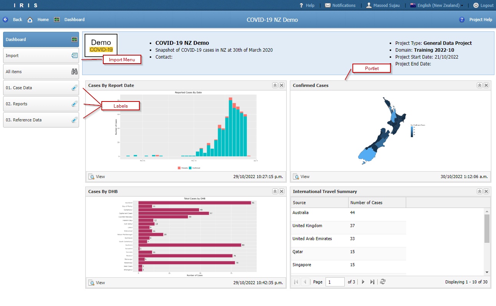
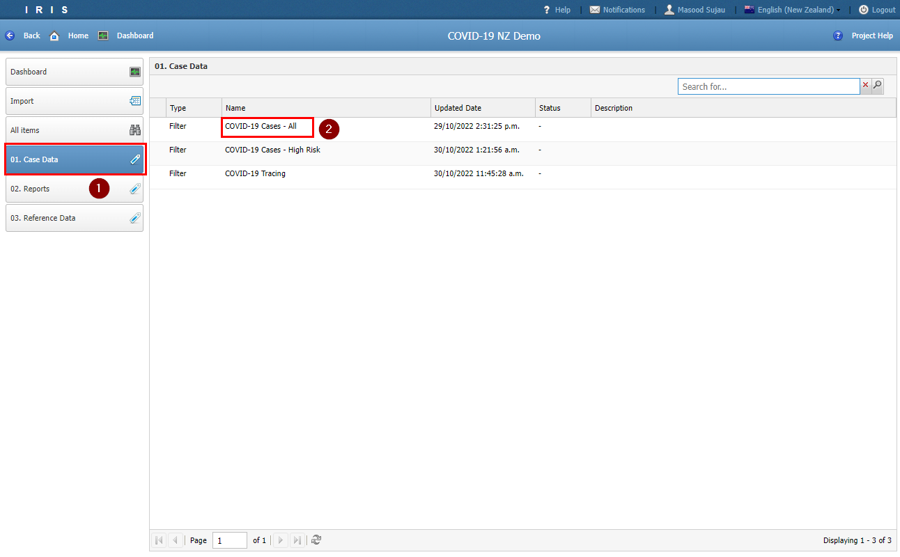
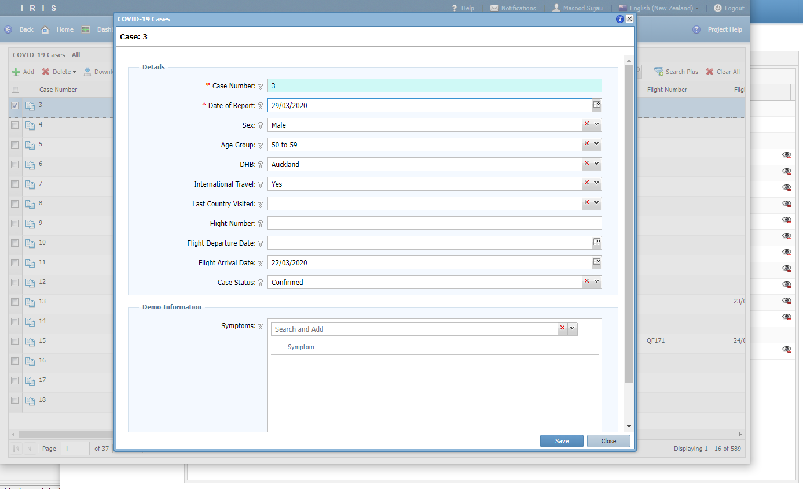
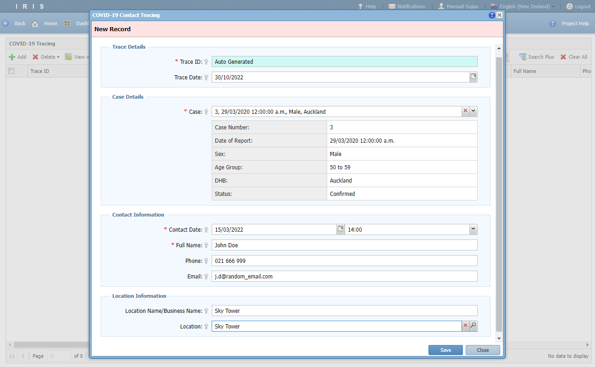
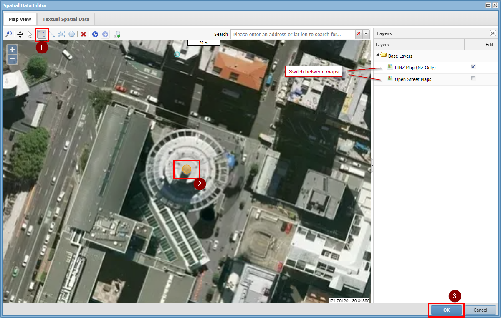
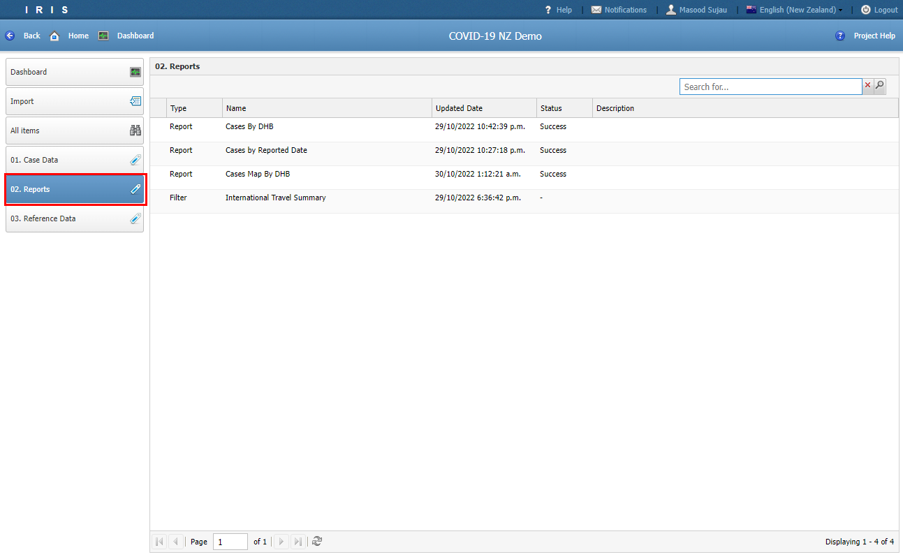
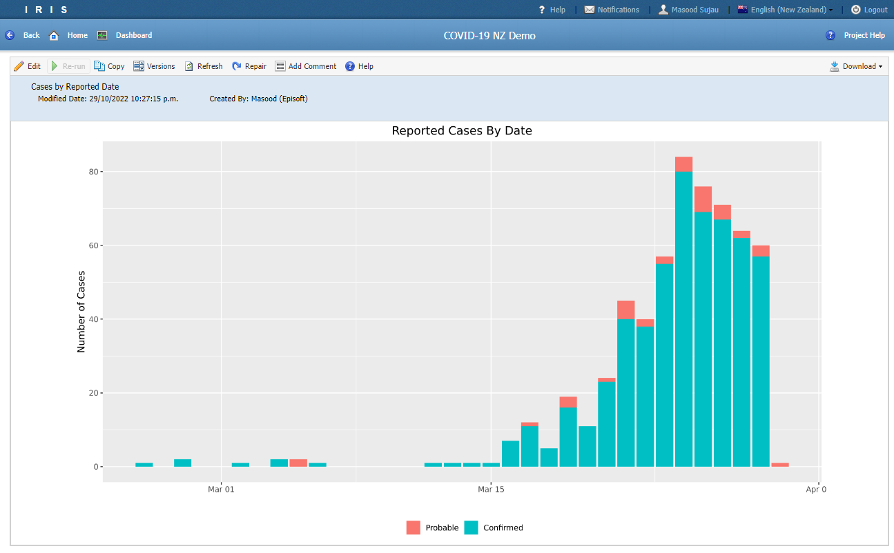

# Tutorial 1

## Navigation

- Once you log into IRIS you will be presented with a list of projects. If you have been assigned only one project then you will be taken directly to the project's dashboard page.

- You can change how projects are presented on the home screen by clicking on the *Group By* menu on the top toolbar

- Click on the **COVID-19 NZ Demo** project to open it.

- Use the buttons on the top toolbar to navigate back a screen or to jump back to the home or dashboard screens.

- Click the *Project Help* to see any notes or comments from the Project Manager.

- The main nvaigation menu of the project is located on the left hand side.

- The **Import** and **All Items** menu are common to all projects but a Project Manager may choose to hide them from users.

- The remaining menu items are customizable and are called **Labels**. For this project we have 3 labels, i.e. Case Data, Reports and Reference Data. Labels are simply a way of grouping items in IRIS.

## Viewing Data

- Click on the **Case Data** label to see a list of datasets made available under this label.

- Click on **COVID-19 Cases - All** to open the dataset.

- All datasets in the system are paged. Paging conttrols can be found at the bottom of the window.

- The top toolbar contains buttons for adding, deleting, downloading and searching data.

- Click on a row to open the record.

- The controls are standard web controls.

- The *Symptoms* field allows you to pick multiple items. You can either type to search for a symptom or click the drop down arrow to see the complete list. Note that the list is paged.

- Click *Close* and click the *Back* button to return to the *Case Data* list.

## Data Entry

- Navigate to the **COVID-19 Tracing** view and try adding some dummy records.\
Dashboard > Case Data > COVID-19 Tracing

- For the *Location* field you can type in an address (e.g Sky Tower) and press enter to do a geo locate the address or you can click the magnifying glass to open up a map.

- Pick the most suitable address and the map viewer will open up to that position.

- Click the *Draw a point* button from the top toolbar. Then click on the target location on the map to place the point. Click *OK* to return to the parent form.

- The centroid value gets copied into the location control.

- Click *Save*.

## Viewing Reports

- Navigate back to the *Dashboard*

- Click on *Reports* to see a list of reports made available under this label.

- Click on a report to view it.

- Currently you do not have permission to run a report in this project and therefore the re-run button is disabled.

## Viewing Reference Data

- The *Reference Data* label is very similar to the *Case Data* label.

- Explore the list of look up values.