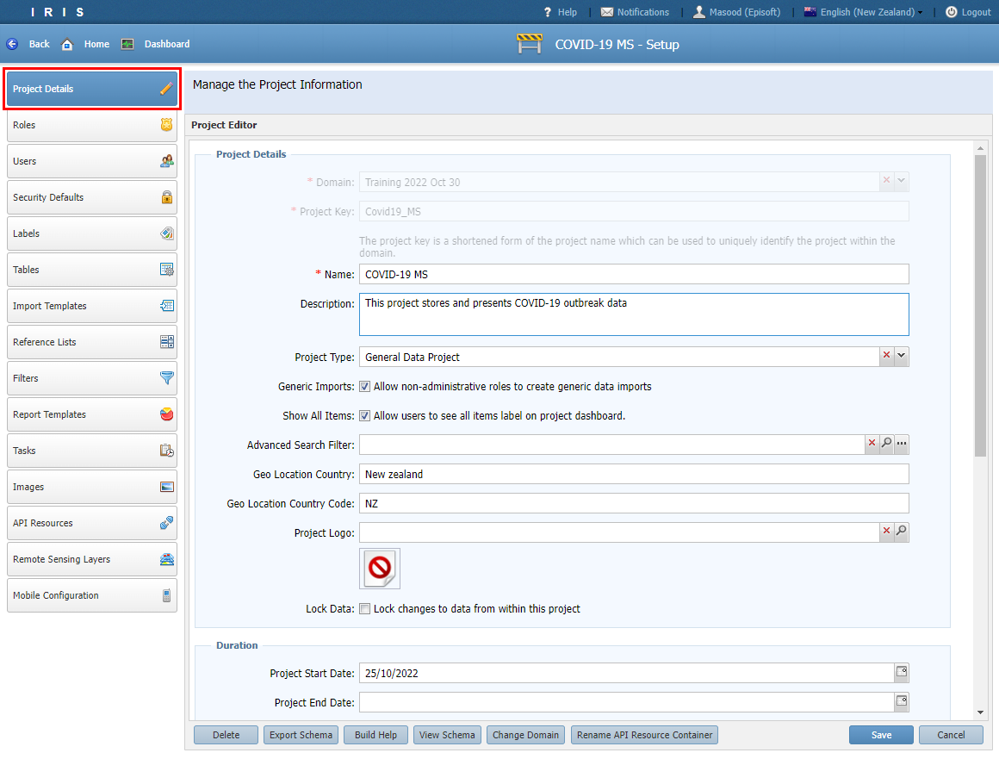
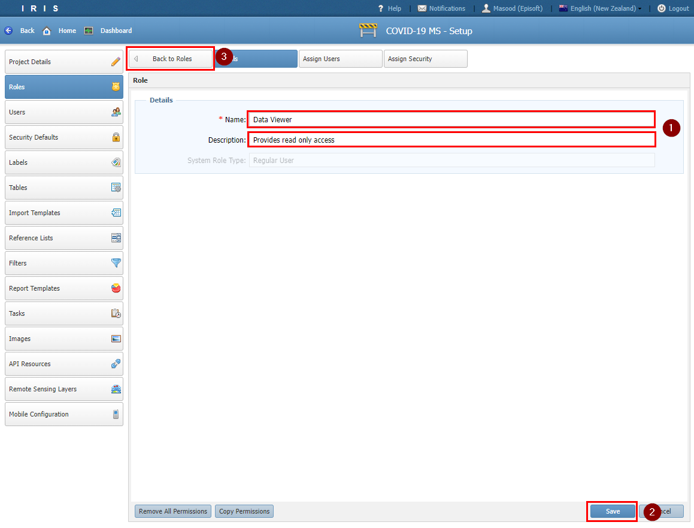
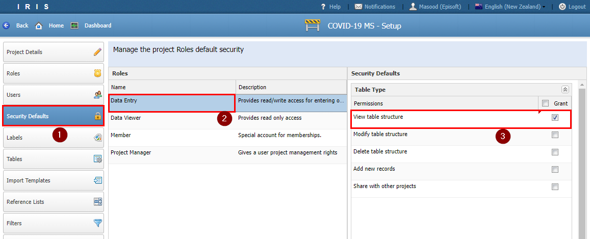

# Tutorial 1

## Basic Project configuration

- To configure a new project you need to access the project's setup menu. 
- Click the **Setup** button located on the top right hand corner. *Note that the setup menu is only available to Project Manager roles.*

- The top banner will change to indicate that you are now in the setup mode. All your configuration menus are located on the left-hand side. We will work our way through each of the menu items.

### Project Details
- In the project details screen we can configure and customise project properties and behaviour.

- Let's start by filling in the following fields:

| Section | Field  | Value | Comment |
| ------------- | ------------- | ------------- | ------------- |
| Project Details <td colspan=3>|
|| Description | This project stores and presents COVID-19 outbreak data. | Gets displayed at the top of the dashboard.|
|| Project Type | General Data Project | Used for categorising projects on the home screen.|
|| Generic Imports | True | End users are allowed to import custom CSV files.|
|| Show All Items | True | The *All Items* menu is visiable to the end user.|
|| Geo Location Country | New Zealand| Default country to use when searching for addresses. |
|| Geo Location Country Code| NZ| Same as above but for Country Code. |
| Map Defaults |
|| Centre X | 174 | The default Longitude value for opening a map. |
|| Centre Y | -41 | The default Latitude value for opening a map. |
| Dashboard Configuration |
|| Configure Portlet View | Two column view | Specifies how many columns to display on the dashboard. |

- Click *Save* to commit the changes

## Security
- It is important to think about security from the start. Adding security at the end is always harder and error prone.
- A great place to start with security is to identify the different types of users of the project and categorize them into roles by functionality or the job they need to perform.

### Roles
- For this project we will create 2 roles
  - Data Viewer
  - Data Entry
- To add a role, select the *Role* tab and click the *Add* button.

- Create the Data Viewer role with the following values

| Section | Field  | Value | Comment |
| ------------- | ------------- | ------------- | ------------- |
| Details |
|| Name | Data Viewer | |
|| Description | Provides read only access | |

- Click *Save* then *Back to Roles* button. 

- Repeat the steps for the Data Entry role.

| Section | Field  | Value | Comment |
| ------------- | ------------- | ------------- | ------------- |
| Details |
|| Name | Data Entry | |
|| Description | Provides read/write access for entering outbreak data | |

- Click *Save*. 

### Users
- You can assign users to roles either by clicking on a *Role* and navigating to *Assign Users* or through the *Users* menu option. 
- Currently we do not have any users for your project so we will skip this step.

### Security Defaults
- Security defaults provide a way for you to automate the task of adding security configurations to newly created project items such as tables, reference lists, filters and report templates.
- Without defaults you will need to remember to do this manually.
- To set security defaults pick a role then tick the permission you want to grant the role.

- For the Data Entry role we want to grant read (or *view*) access to any newly added tables or reference lists in the project.

- Tick the following permissions for the Data Entry role and click *Save*

| Project Item | Permission  | Tick |
| ------------- | ------------- | ------------- |
| Table Type |
|| View table structure | Yes | 
| Reference List |
|| View list | Yes | 
| Filter |
|| View filter | Yes | 

- For the Data Viewer role we want to grant the following permissions.

| Project Item | Permission  | Tick |
| ------------- | ------------- | ------------- |
| Table Type |
|| View table structure | Yes | 
| Reference List |
|| View list | Yes | 
| Report Type |
|| View report template | Yes |
|| View newly created reports | Yes |
| Filter |
|| View filter | Yes | 