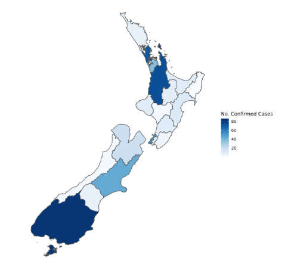
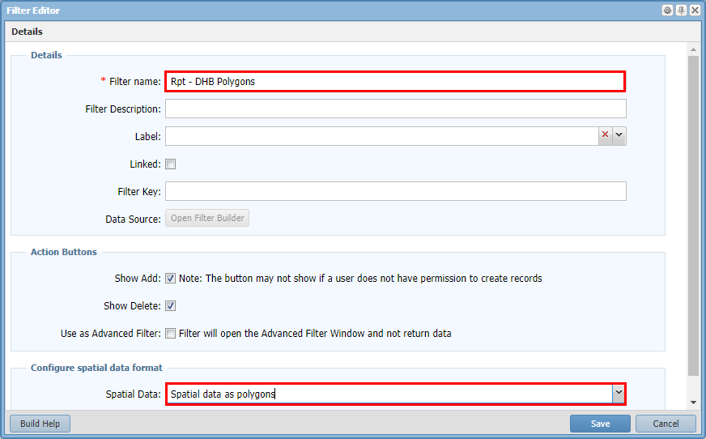
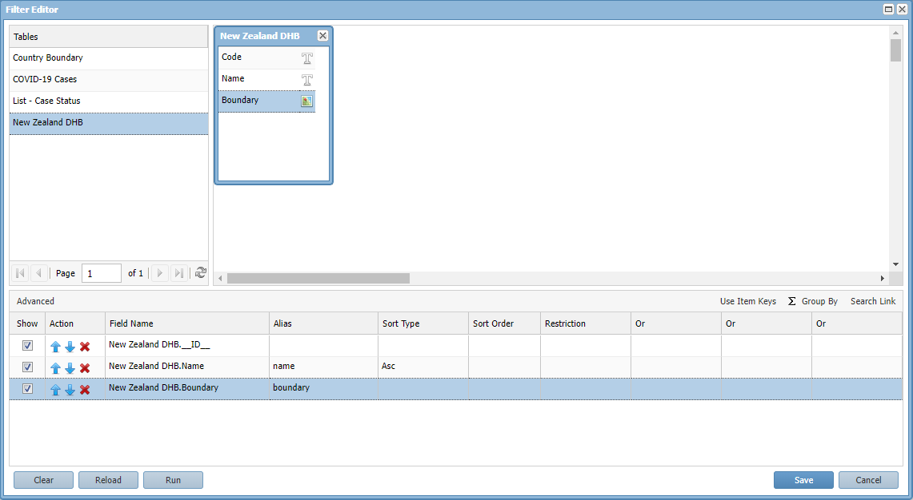
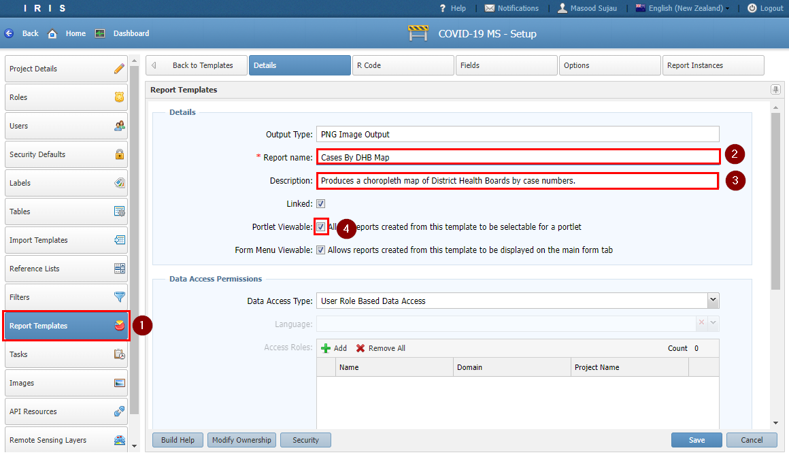
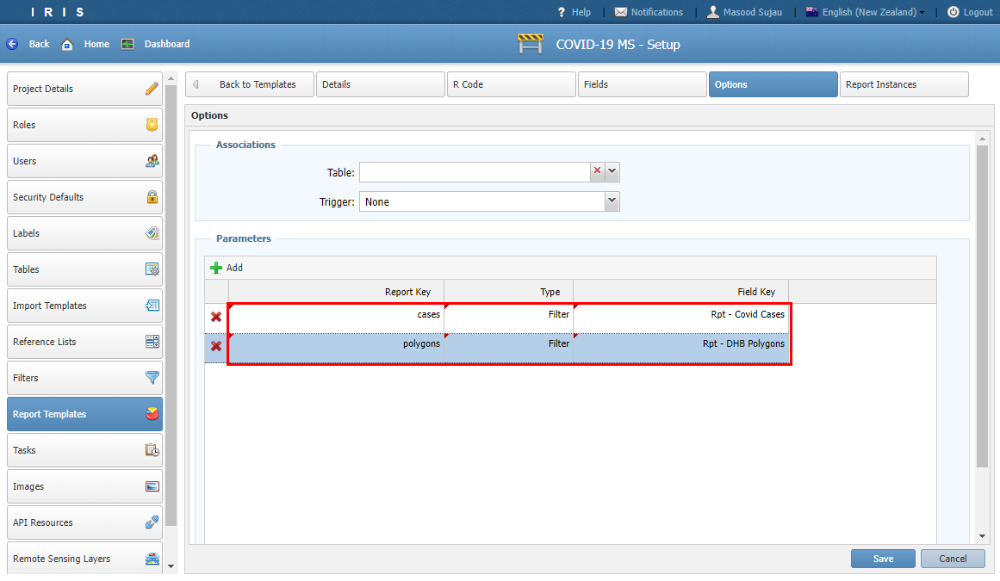
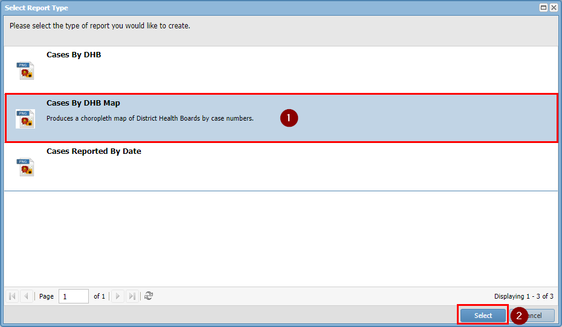
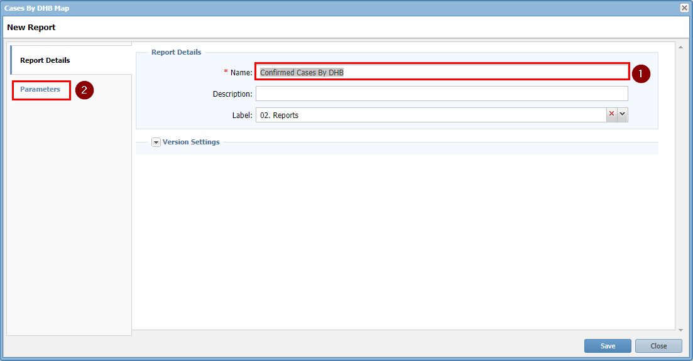
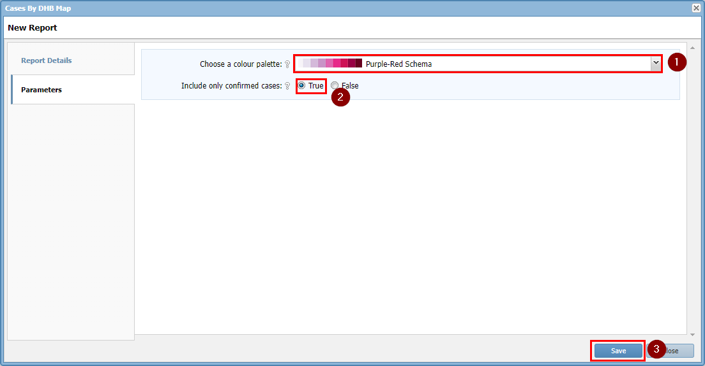

# Tutorial 10

## Building Report Templates - Spatial Map

- In this tutorial we will build a choropleth map of the DHB boundaries by the number of cases.

- We will provide the end user a way to change the colour palette and also specify if they if they want to show all cases or just confirmed cases.



- In order to draw any type of map we need to supply the reporting engine with spatial data. We do this by creating a filter.

- Navigate to *Filters* and create a filter called **Rpt - DHB Polygons** and change the *Spatial Data* field to **Spatial data as polygons**.



- Build the filter to match the image below



- Navigate to the *Report Template* menu 

- Add a new *PNG Image Output* template called **Cases By DHB Map** and tick the *Portlet Viewable* option.



- Cut and paste the R code below in the *R Code* tab

```
#------------ START ------------

library(data.table)
library(tidyverse)
library(ggplot2)
library(sf)
library(sp)
library(rgdal)
library(rgeos)

plotName <- 'MapData.png'

legendTitle <- 'No.Cases (All)'
numberOfColours <- 20

#IRIS only passes back 9 colours so create a colour ramp to get more colours
colorPalette <- colorRampPalette(params$colour_palette)

#set the projection - we always deal in this projection
target.crs <- "+init=epsg:4326";

#read the cases from the csv file
cases <- fread(params$cases, header = TRUE, sep = ",", stringsAsFactors=FALSE)

#filter down to only confirmed cases if user has specified so
if (params$only_confirmed == TRUE) {
        
        cases <- cases %>% filter(status == 'confirmed')
        
        #update the legend to reflect the filtering
        legendTitle <- 'No. Confirmed Cases'
}

#group by the DHB and get a tally
cases <- cases %>%        
        group_by(dhb) %>%
        tally()

#read the DHB boundary csv file
#convert the boundary column into a simple feature (spatial object)
#then join the table to the cases table by matching the name field to the dhb field
boundary <- fread(params$polygons, header = TRUE, sep = ',') %>%
        st_as_sf(wkt="boundary", crs=target.crs) %>%
        left_join(cases, by=c("name" = "dhb"))

#plot the map
ggplot(boundary) + 
        geom_sf(aes(geometry = boundary, fill = n)) +
        scale_fill_gradientn(colours = colorPalette(numberOfColours)) +
        labs(fill= legendTitle) +
        theme(
                panel.background = element_blank(),
                
                legend.position = "right",
                
                axis.title.y=element_blank(),
                axis.text.y=element_blank(),
                axis.ticks.y=element_blank(),
                
                axis.title.x=element_blank(),
                axis.text.x=element_blank(),
                axis.ticks.x=element_blank()
        )


#save as an image
ggsave(filename = plotName, width = 8, height = 9)

#return the name of the image
return(plotName)

#------------ END ------------
```

- Navigate to the *Fields* tab.

- Here we can create report fields just like how we built Table fields.

- The system automatically create a *Form* called **Parameters** and a *Section* called **Options** for us.

- Click on the **Options** node and *Add* then pick *Color*

- Fill out the following fields and click *Save*

| Section | Field  | Value | Comment |
| ------------- | ------------- | ------------- | ------------- |
| General |
|| Field Key | colour_palette | |
|| Name | Choose a colour palette | |
| Data Type Specific |
|| Color Spectrum | Blues schema | |


- Repeat the steps above but this time add a *Boolean* field with the following values.

| Section | Field  | Value | Comment |
| ------------- | ------------- | ------------- | ------------- |
| General |
|| Field Key | only_confirmed | |
|| Name | Include only confirmed cases | |
| Data Type Specific |
|| Control Type | Radio Buttons | |
|| Default | True | |

- Next go to the *Options* tab. 

- Here we will add our new **Rpt - DHB Polygons** filter and the **Rpt - Covid Cases** filter from the previous tutorial.

| Report Key | Type  | Field Key |
| ------------- | ------------- | ------------- | 
| cases | Filter | Rpt - Covid Cases |
| polygons | Filter | Rpt - DHB Polygons |



- Let's create the report by navigating to *Dashboard* > *02. Reports* and click *Add Report*.


- Select **Cases By DHM Map**



- Set the report *Name* to **Confirmed Cases By DHB**

- Then click on the *Parameter* tab.



- Change the colour palette to your choosing and then set *Include only firmed cases* to **True**.

- Click *Save*




- You can change the parameters by clicking the *Edit* button.

- Try making a copy of the report and changing the parameters to show all cases with a different colour scheme.

- Try and add the new report as a portlet.
